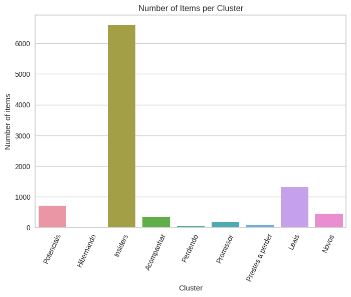
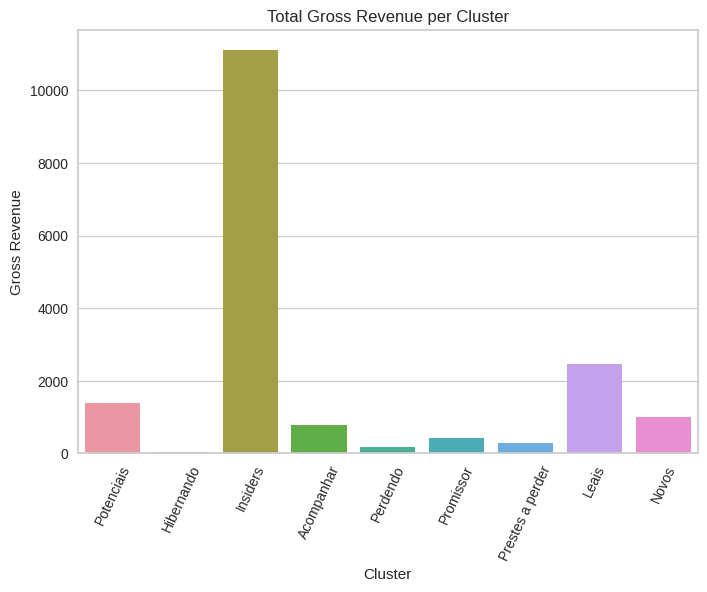
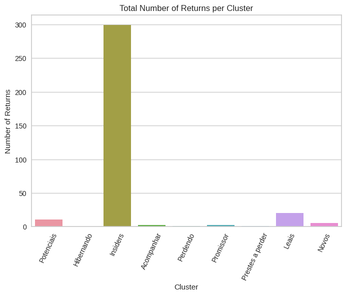
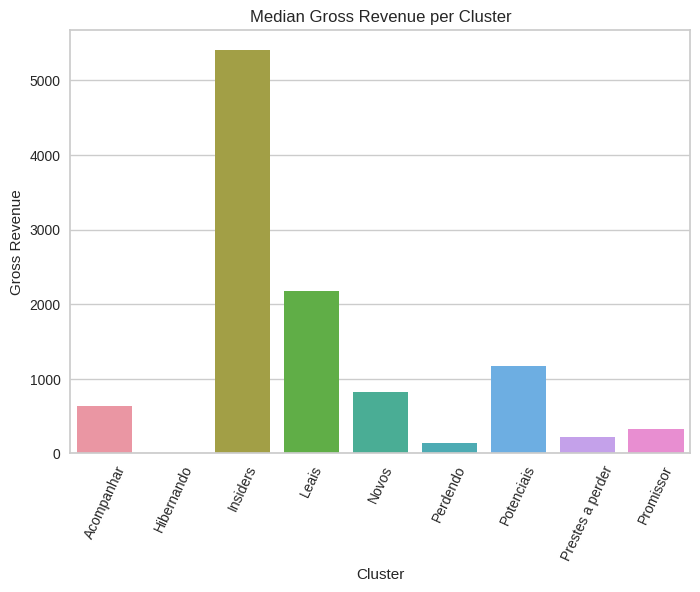
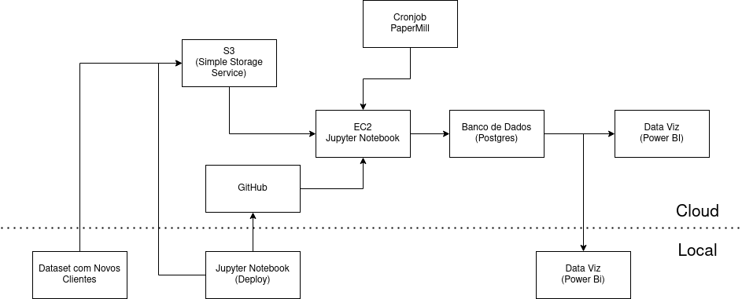

# Programa Insiders - Fidelização de Clientes
A Mercury Store é empresa inglesa fictícia de outlet multimarcas, que comercializa produtos de segunda linha de diversas marcas a um preço reduzido, através de um e-commerce.

Foto de <a href="https://unsplash.com/@rupixen?utm_source=unsplash&utm_medium=referral&utm_content=creditCopyText">rupixen.com</a> na <a href="https://unsplash.com/pt-br/fotografias/Q59HmzK38eQ?utm_source=unsplash&utm_medium=referral&utm_content=creditCopyText">Unsplash</a>

# Conhecendo o negócio
Em pouco mais de 1 ano de operação, o time de marketing percebeu que alguns clientes da sua base compram produtos mais caros, com certa frequência e acabam contribuindo com uma parcela significativa do faturamento da empresa.

Com essa informação, o time de marketing planeja lançar um programa de fidelidade para os melhores clientes da base, nomeado **Insiders**. Porém o time não possui conhecimento avançado em análise de dados para eleger os participantes do programa.

# 1. Questão de negócio
Para uma seleção de clientes elegíveis ao programa, utilizando técnincas avançadas de manipulação de dados, a tarefa foi requisitada ao time de dados.

O resultado será uma lista de pessoas elegíveis, com a qual o time de marketing fará uma sequência de ações personalizadas e exclusivas para o grupo, visando aumentar o faturamento e a frequência de compra. Além de um relatório com as seguintes questões respondidas:

1. Quem são as pessoas elegíveis para participar do programa de Insiders?
2. Quantos clientes farão parte do grupo?
3. Quais as principais características desses clientes?
4. Qual a porcentagem de contribuição do faturamento, vida dos Insiders?
5. Qual a expectativa de faturamento desse grupo para os próximos meses?
6. Quais as condições para uma pessoa ser elegível ao Insiders?
7. Quais as condições para uma pessoa ser removida dos Insiders?
8. Qual a garantia que o programa Insiders é melhor que o restante da base?
9. Quais ações o time de Marketing pode tomar para aumentar o faturamento?

## 1.1. Entendendo os dados
Para realizar esse projeto estão disponíveis as faturas geradas por cada compra, itens, quantidades e preços dos produtos. Os dados são referentes a compras realizadas no e-commerce durante o período de um ano (Nov 2015 - Dez 2017).

|Atributo|Definição|
|--------|---------|
|InvoiceNo| Número de identicação da fatura|
|StockCode| Código de estoque único referente ao produto comprado|
|Description| Descrição do produto ofertado|
|Quantity| Quantidade de itens comprados (ou devolvidos em caso de valores negativos)|
|InvoiceDate| Data da emissão da fatura|
|UnitPrice| Preço unitário do produto|
|CustomerID| Código de identificação único do cliente que realizou a compra|
|Country| País onde a compra foi realizada|

# 2. Premissas de negócio
* Alguns clientes foram desconsiderados para criação dos agrupamentos por apresentarem comportamento não desejável (por exemplo, retornar todos os itens comprados)
* Produtos com preço unitário menor que £0,04 foram considerados brindes, e não foram somados ao faturamento gerado.
* Códigos de estoque referentes a processos de postagem e taxas foram desconsiderados.

# 3. Planejamento da solução
O planejamento da solução foi divido em três etapas:

## 3.1. Produto Final
O produto final será uma lista com os clientes agrupados, gerando o Programa Insiders, e o relatório respondendo as perguntas de negócio do time de marketing.

Além disso com o modelo gerado com os dados dos clientes atuais, será criado um sistema em produção para classificação de novos clientes nos clusters, que em seguida são inseridos em um banco de dados Postgres para visualização através de dashboards online e localmente, através do *Power BI*.
## 3.2. Processo

### _Entendendo o problema de negócio_
Entender a necessidade de agrupamento para o time de marketing e gerar a melhor solução para criação do Programa Insiders.

### _Coleta de dados_
Coleta dos dados na plataforma *Kaggle*.

### _Limpeza dos dados_
Colunas renomeadas, limpeza dos dados e criação de Identicadores únicos para faturas sem identificação do cliente e verificação dos tipos de dados de cada coluna. Filtragem das variáveis após análise inicial dos dados.

### _Feature Engineering_
Criação de features para uso no treinamento dos modelos de machine learning.

### _Análise Exploratória de Dados (EDA)_
Exploração dos dados para adquirir conhecimento de negócio, analisar valores inconsistentes e comportamento dos dados. Para isso foi utilizado o pacote [Ydata Profiling](https://ydata-profiling.ydata.ai/docs/master/) (antigo Pandas Profiling). Profile disponível para download [aqui](profiling/output_v2.html).

### _Feature Selection_
Seleção de variáveis que serão utilizadas para treinamento.

### _Preparação dos Dados_
Uso de técnicas para reescalonamento dos dados.

### _Machine Learning Modeling_
Implementação de técnicas de redução de dimensionalidade e criação de espaços para aplicação de modelos de clusterização, e estudo de diferentes números de clusters (grupos) gerados pelos algoritmos.

### _Avaliação dos Modelos_
Avaliação dos modelos através da métrica _Silhouette Score_.

### _Análise Exploratória dos Clusters_
Análise dos clusters gerados e uso dos dados para responder as perguntas do time de marketing e gerar Insights para o negócio.

### _Relatório e Deploy do Modelo_
* Relatório com os resultados obtidos
* Modelo em produção para classificação de novos clientes
* Dashboards em Power BI, online e local.

## 3.3. Ferramentas
* Python 3.8.12
* Pandas, Seaboarn, Matplotlib, Skelear, Pandas Profiling
* SQL com SQLite e PostgreSQL
* Git
* Amazon Web Service (S3, RDS e EC2)
* Técnicas de redução de dimensionamento: PCA, t-SNE e UMAP/Random Forest
* Algoritmos de Clusterização (K-Means, Gaussian Mixture Model, Hierarchical Clustering e DBSCAN)
* Métrica de performance: _Silhouette Score_
* Power BI Desktop e Service

# 4. Modelos de Machine Learning
Para melhorar o espaço de dados foram implementadas técnicas de redução de dimensionalidade:
* PCA (Principal Component Analysis)
* t-SNE (t-Distributed Stochastic Neighbor Embedding)
* UMAP (Uniform Manifold Approximation and Projection)
* Random Forest/UMAP (Tree-Based Embedding) considerando Gross Revenue para treinamento da árvore.

Os resultados com Tree-based Embedding apresentaram resultados satisfatórios. Assim, com o espaço gerado foram treinados 4 modelos, variando o número de clusters (k) entre 2 e 30:
* K-Means
* Gaussian Mixture Models (GMM)
* Hierarchical Clustering (HC)
* DBSCAN

Os modelos foram avaliados pela métrica _Silhouette Score_. Para determinação do número de clusters foram comparados os valores de silhoueta e considerando o problema de negócio, e mesmo os melhores valores sendo alcançados com número de clusters por volta de 25, o número escolhido para prosseguimento foi **9**. Pois apresenta valor de silhoueta pouco abaixo do valor ótimo e corresponde as expectativas do time de marketing em trabalhar com um número menor de grupos para o Programa Insiders (o modelo DBSCAN não foi considerado para comparação por necessitar de otimização mais profunda e apresentar grande número de clusters).

O modelo escolhido para clusterização foi K-Means com uma _Silhouette Score_ de 0,585317.

## Entendendo as métricas
A métrica de _Sihouette Score_ varia de -1 até 1, onde 1 sendo o resultado ideal. É composta de duas propriedades para criação de clusters:
* **Compacidade** ou **Coesão**: mede quão próximos os objetos estão dentro do mesmo cluster. Uma baixa variação intra-cluster indica boa compacidade.
* **Separação**: mede quão bem separado um cluster está dos outros. 

# 5. Resultado de negócio
Com os clusters formados os seguintes Insights foram gerados:

## Os clientes do cluster Insiders possuem um volume (produtos) de compras de 58,87% do total de compras da base.

## Os clientes do cluster Insiders possuem um volume (faturamento) de compras de 53.86% do total de compras da base.

## O cluster Insiders tem média de devoluções acima da média geral.

## A mediana do faturamento do cluster Insiders é 781,46 vezes maior do que a mediana da base.

# 6. Deploy do modelo
Para deploy do modelo foram utilizados serviços da AWS (Amazon Web Service)

* Criação de um _Bucket_ na Amazon S3 (Simple Storage Service) para armazenamento dos datasets dos clientes e modelos treinados para classificação dos novos clientes.
* Criação de um Banco de Dados Postegres na Amazon RDS (Relational Database Service) para armazenamento dos dados dos clientes agrupados, disponível para acesso para desenvolvimento de Dashboards em Power BI.
* Instância na Amazon EC2 (Elastic Compute Cloud) com computador virtual Linux que acessa os dados e modelos para classificação de novos clientes, realizando as tarefas de modo automático através de agendador de tarefas (CronJob e PaperMill).

Com o modelo implementado, foram gerados: o [Relatório]() respondendo as necessidades do time de marketing, uma lista com os [clientes classificados](reports/clusters.csv), uma versão estática do [Dashboard](reports/Dashboard%20Programa%20Insiders.pdf) para fins de conveniência e a **versão interativa** do Dashboard publicado no _Power BI Service_, disponível no botão abaixo.

# 7. Conclusão
O objetivo de agrupar os clientes para o novo programa de fidelidade foi alcançado, sendo entregue um relatório e Insights para o time de marketing. Além de Dashboards e um modelo automático para integração de novos clientes.

# 8. Próximos passos
* Criar novas features para melhorar o modelo.
* Obter mais dados referentes aos clientes.
* Utilizar as datas de emissão das faturas para gerar Insights.
* Automatizar o processo de criação de clusters para refazer os grupos depois de certo período determinado.